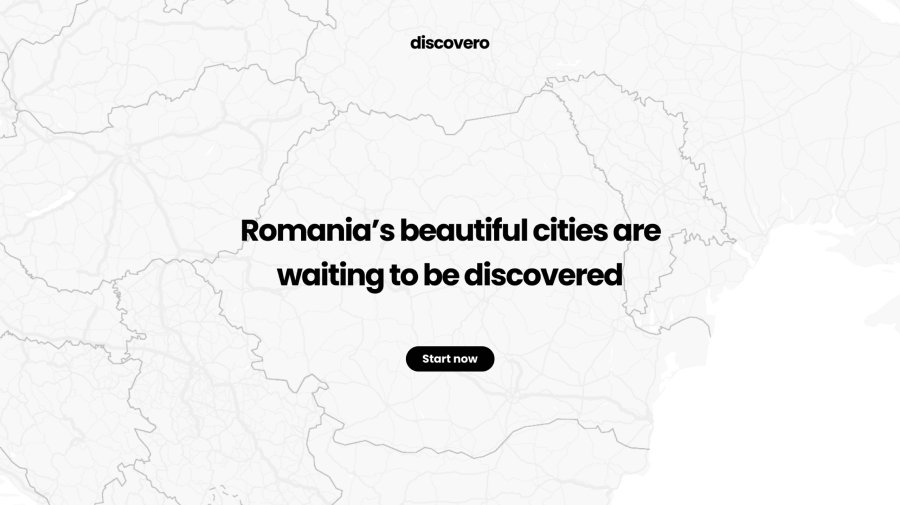
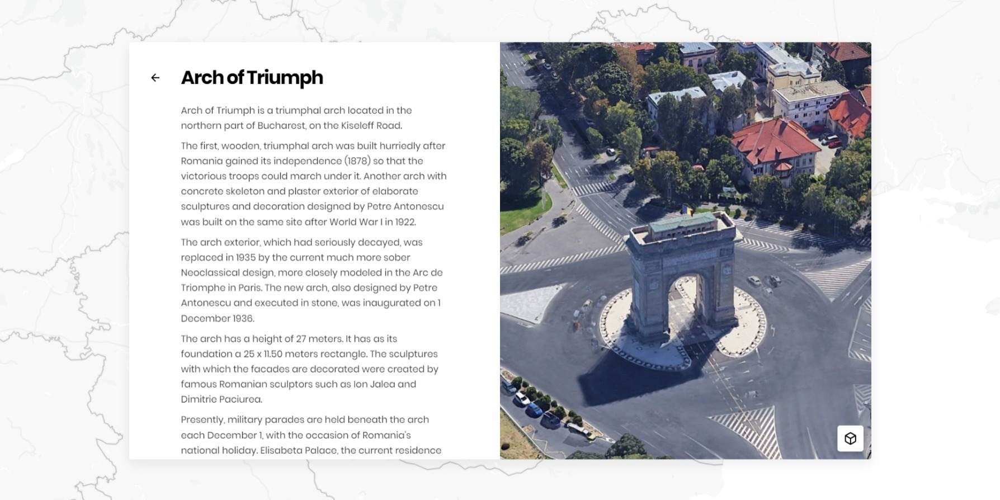
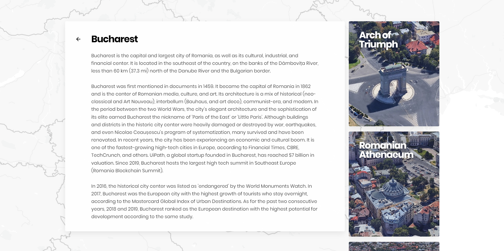

# Discovero

## March, 2020 [GitHub](https://github.com/vlad-solomon/discovero) [Site](https://vlad-solomon.github.io/discovero/)

## Discovero's final landing page after many design iterations

Discovero is a website that I started developing in March of 2019. I wanted to develop a new site at the time but had no real idea of what type of site, until the idea of exploring my own country - Romania - came to mind. That's also where the name "Discovero" comes from: Discover Romania. The landmark exploration was the objective from the start, but it turned out I wasn’t quite happy with the design. When this project was completed, Discovero was redesigned a grand total of 3 times. I wanted to feel proud of this project, and even if the final UI is really simple, I think it represents the project extremely well.

## This is how a landmark page looks. Note the button (bottom right) that lets you view it in 3D

The website was simple: A home page with lots of cities; you pick a city, maybe read about it, and then go explore and read about the most famous landmarks in said city. You could even find out new things about Romania while you were browsing for a city. This idea was later scrapped - but not totally, as it was the base for the landmark cards, which are the most important part of this whole website.

## This is how the landmark card evolved through the first version of the design

Skip ahead a few months where ideas are scrapped, reintroduced, and then scrapped again. I'm not even going to show you how the second version turned out; holy Jesus that was bad. But, thankfully, after thinking about a very streamlined design, that combined all the good parts from all of the previous iterations, I got to Discovero 3.0, as I began to call it.

## So clean, so nice ^\_^

This, now this is beautiful. Apart from using only one typeface, Discovero also uses one single animation. A simple fly-towards-the-screen animation when a city or a landmark is picked. I developed this animation to look like the user is going down a rabbit hole, browsing for something, not knowing what exactly would be found. Also, a very much "required" option these days is to have a dark mode, so naturally, one was added - BUT, you'll have to see it for yourself. Check it out below!.

### [Visit Discovero](https://vlad-solomon.github.io/discovero/)
