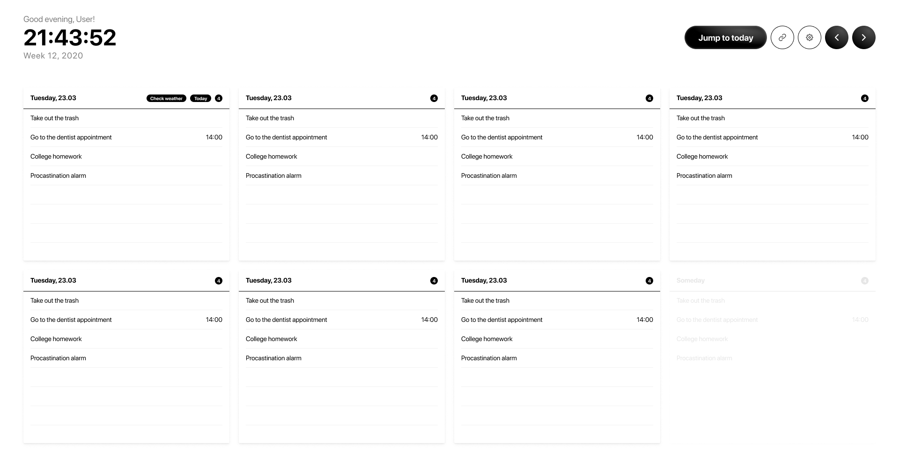
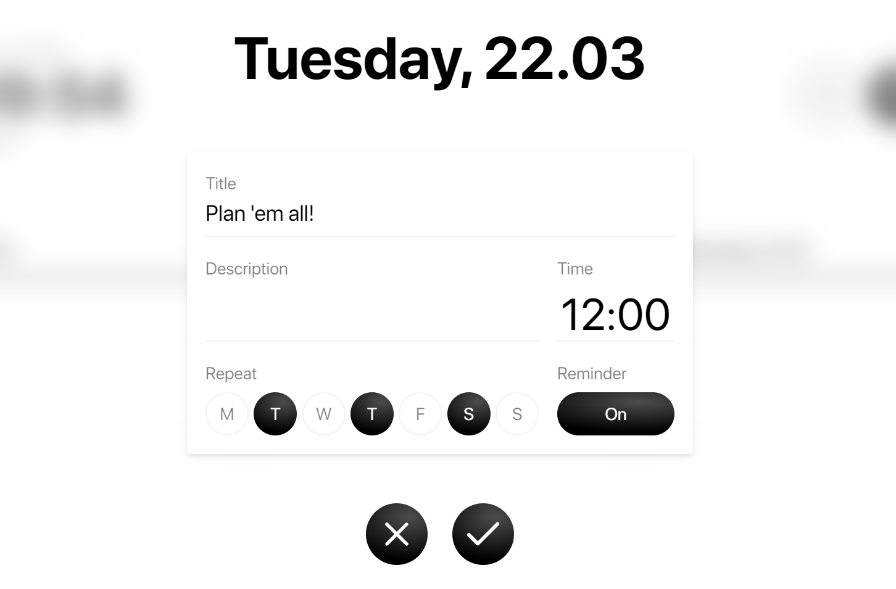
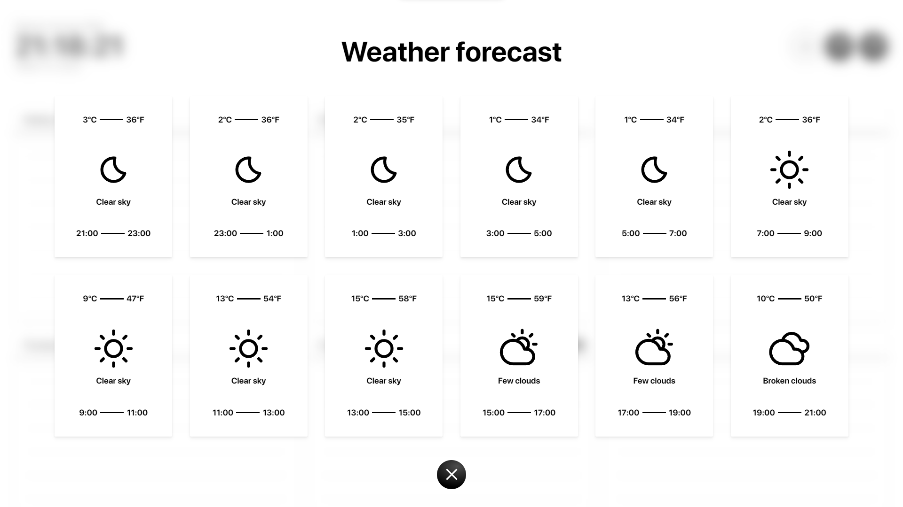

# Proton Calendar

## April, 2021 [GitHub](https://github.com/vlad-solomon/proton-calendar) [Site](https://vlad-solomon.github.io/proton-calendar/)

This is the project that I invested the most in. When I started developing this one, I was very interested in how I could use JavaScript to develop a productivity app. I know, I know, we all made at least one to-do app, but I wanted something more, and also clean and simple. I still can't get my head around how people use Google Calendar. Mine is nowhere near better, but still, what the hell is that interface? I just want to see some boxes with dates on the screen and add, remove, or edit tasks.

## This is the final design before I started coding the UI

The app is extremely simple and to be honest, I could not figure out how I could have made it simpler to use. Ease of use was a very important thing for me, as I wanted Proton to resemble a traditional and physical calendar almost 1 to 1. A calendar should not be complicated.

## Creating a task never looked this cool

That's why I poured my heart into creating the best "create a task" modal there ever was. Who said that? ME! It has all the things it needs. Title, description, even a repeat option. Seriously now, I think even Steve Jobs would like how this dialogue looks, and I'm very proud of it if you couldn't tell.

## Thanks to OpenWeather API, I could also implement a 24-hour weather forecast

Also, this was the first project in which I used a database. Originally, it used the Local Storage API, but after being sick of organizing objects and splicing arrays - which worked well, don't get me wrong - I studied the Firebase Docs and implemented not only real-time listening but also authentication. Speaking of logging in, hop onto Proton Calendar using the link below; I'm sure you have a Google or Facebook account. I bet you'll like it, and if you don't, you'll get your money back - Oh wait, it's free!

### [Visit Proton Calendar](https://vlad-solomon.github.io/proton-calendar/)
