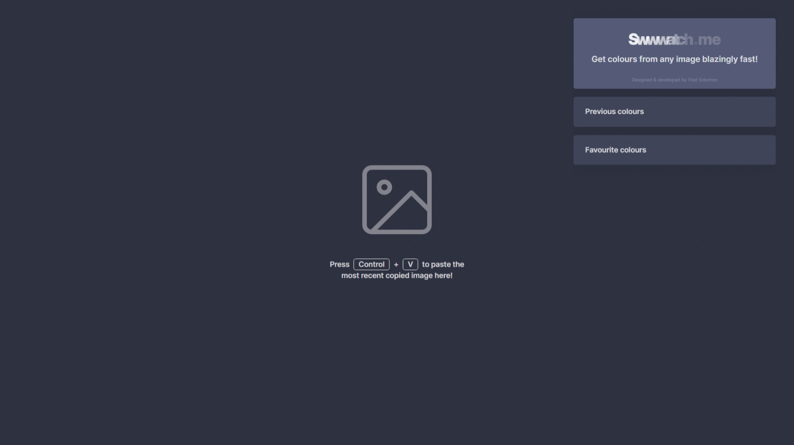

# Swwwatch.me

## March, 2022 [GitHub](https://github.com/vlad-solomon/swwwatch.me) [Site](https://swwwatch.me/)

It seems like I've typed "grab colors from image" into Google a few too many times, only to find old and scuffed websites. This is where Swwwatch.me comes into play.

## Swwwatch.com's homepage

You simply copy any image - GIFs also work, no matter how you pronounce the abbreviation. You can also pan and zoom the image to make it easier to pick a color.

## Picking a color from the image

After picking a color, details about it are shown: similar colors and some color conversions in the most popular formats, like RGB and HSL. It also gets saved in the "Previous colors" drawer. For easy access, the user can also save a color as a favorite, which can be queried later for the same details as before.

## Generated color scheme from the pasted photo, that can also be downloaded

The last feature - generating a color scheme from the pasted image. The user can preview the color palette, and then download it.

All in all, a very simple tool. One drawback: at the time of writing, the [EyeDropper API](https://developer.mozilla.org/en-US/docs/Web/API/EyeDropper_API) only works in browsers based on Chromium, so no Firefox support just yet, but I'm sure they'll add it. So, get your Google Chrome or Microsoft Edge booted up and visit the site at the link below.

### [Visit Swwwatch.me](https://swwwatch.me/)
