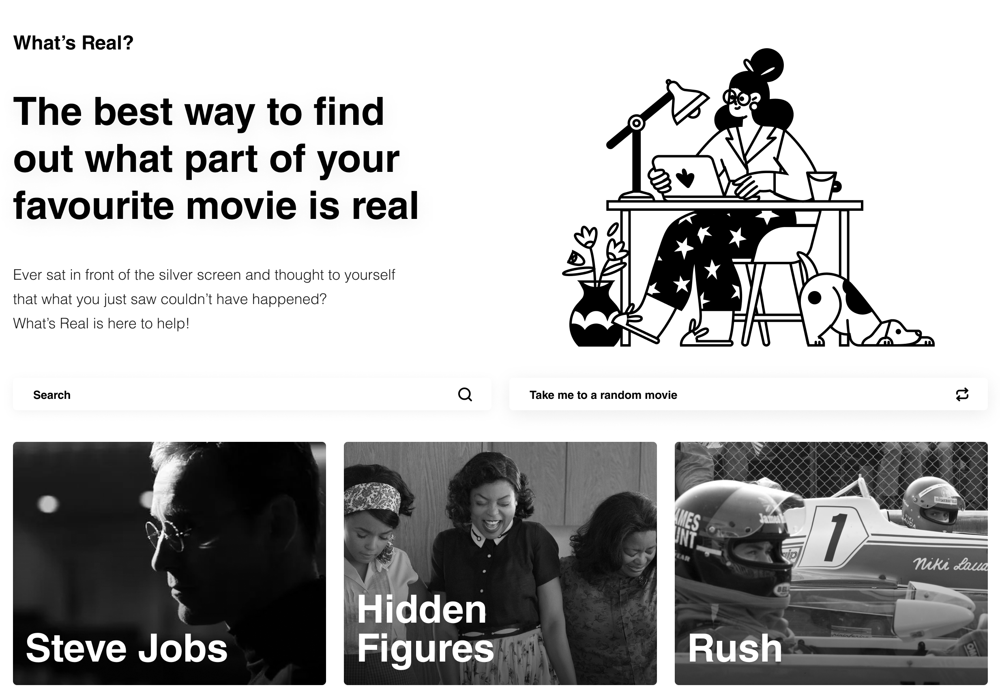

# What's Real?

## September 2020 [GitHub](https://github.com/vlad-solomon/whats-real) [Site](https://vlad-solomon.github.io/whats-real/)

I love movies. I'm a really big movie enthusiast, so naturally I wanted to create a website revolving around this theme. I was a senior in high-school when I stumbled upon the idea of comparing "This is a true story" movies with what actually happened. I was in luck, seeing as websites like that actually existed; now I needed to just improve on their designs - and to be honest, I think I did.

## What's Real? homepage

Designing in black and white is a bit of a challenge, but I love the uniformity that it provides. I really wanted to accentuate the difference between truth and fictions, hence the contrast of these colors.

## The design of the movie page, including details about the film, scene comparisons, cast and more

In the end, I think the website turned out great, and fulfilled my needs to create a beautiful and uniform design around one of my favorite pastimes.

### [Visit What's Real?](https://vlad-solomon.github.io/whats-real/)
